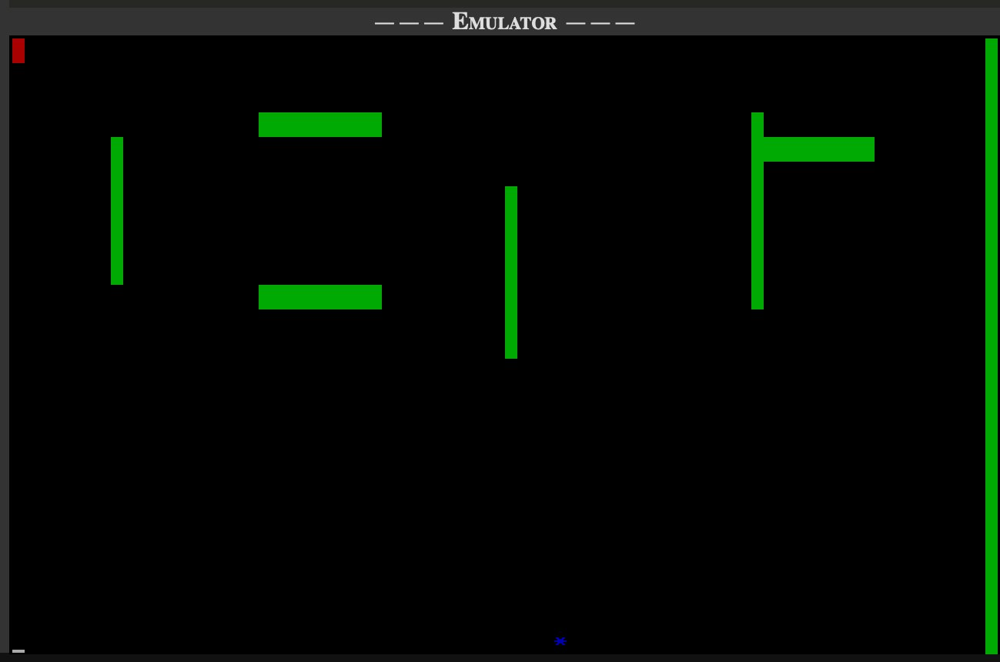

# MovingStar 🌟

A maze navigation game written in **8088 Assembly Language**, running as a DOS `.COM` program. Navigate a blue asterisk (`*`) through green obstacles to reach the red goal at the top-left corner — without hitting anything.



---

## 📋 Table of Contents

- [Overview](#overview)
- [Features](#features)
- [Controls](#controls)
- [Game Rules](#game-rules)
- [Screen Layout](#screen-layout)
- [How It Works](#how-it-works)
- [Building](#building)
- [Running](#running)
- [Project Structure](#project-structure)
- [Technical Details](#technical-details)

---

## Overview

MovingStar is a real-mode x86 (8088) assembly game that writes directly to video memory (`0xB800`) and hooks the BIOS timer (IRQ 0) and keyboard (IRQ 1) interrupt vectors. The player navigates a star character through a maze of green obstacles toward a red goal cell.

---

## Features

- Direct video memory manipulation (CGA text mode, 80×25)
- Custom timer interrupt handler (IRQ 0 / INT 8h) for smooth movement
- Custom keyboard interrupt handler (IRQ 1 / INT 9h) for arrow-key input
- Collision detection with obstacles and screen boundaries
- Win / Loss detection with end-game messages
- Safe interrupt vector restoration before exiting to DOS

---

## Controls

| Key        | Action    |
|------------|-----------|
| ↑ Arrow    | Move Up   |
| ↓ Arrow    | Move Down |
| ← Arrow    | Move Left |
| → Arrow    | Move Right|

The player starts moving **rightward** by default.

---

## Game Rules

1. The player (`*`, blue on black — attribute `0x01`) starts at **Row 24, Column 40** (center of the last row).
2. The **goal** is a red-background space (`0x4420`) at the **top-left corner** (Row 0, Col 0).
3. **Green obstacles** (`0x2220`) are scattered across the screen, including the full right boundary (Column 79).
4. The player moves one step every **2 timer interrupts**.
5. **Collision with any obstacle or the right boundary** → `Game Lost`
6. **Reaching the goal cell** → `Game Win`
7. After the game ends, the old interrupt vectors are restored for safe DOS operation.

---

## Screen Layout

```
[RED GOAL]                                                        [RIGHT BOUNDARY →]
                                                                  ║
         ║          ══════════                                    ╔══════════
         ║                                           ║            ║
         ║          ══════════             ║
                                           ║
                                           ║

                          [PLAYER * starts here at Row 24, Col 40]
```

- 🟥 **Red cell** = Goal (top-left)
- 🟩 **Green cells** = Obstacles (walls + internal maze)
- 🔵 **Blue `*`** = Player

---

## How It Works

### Interrupt Hooking

```asm
; Hook Timer (INT 8h) and Keyboard (INT 9h)
cli
mov word [es:8h*4],   timer   ; Timer ISR offset
mov word [es:8h*4+2], cs      ; Timer ISR segment
mov word [es:9h*4],   key     ; Keyboard ISR offset
mov word [es:9h*4+2], cs      ; Keyboard ISR segment
sti
```

### Timer ISR (`timer`)

- Increments a tick counter every hardware timer interrupt (~18.2 Hz).
- Every **2 ticks**, calculates the new player position based on current direction.
- Checks for wall/obstacle collision or goal reached.
- Updates video memory directly.

### Keyboard ISR (`key`)

- Reads the hardware scancode from port `0x60`.
- Updates the `direction` variable (0=Right, 1=Up, 2=Left, 3=Down).
- Sends EOI (`0x20`) to the PIC.

### Collision / Win Detection

| Memory Value | Meaning            | Result       |
|--------------|--------------------|--------------|
| `0x4420`     | Red background cell | **Game Win** |
| `0x2220`     | Green obstacle      | **Game Lost** |
| `di < 0` or `di ≥ 4000` | Off-screen  | **Game Lost** |

### Safe Termination

Old timer and keyboard vectors are saved at startup and restored before `INT 21h / AX=4C00h` exit, ensuring DOSBox and subsequent programs run normally.

---

## Building

### Prerequisites

- [NASM](https://www.nasm.us/) assembler
- [DOSBox](https://www.dosbox.com/) (or any DOS environment)

### Assemble

```bash
nasm -f bin src/MovingStar.asm -o MovingStar.com
```

This produces a flat binary `.COM` file ready to run under DOS.

---

## Running

1. Place `MovingStar.com` inside your DOSBox mounted directory.
2. Open DOSBox and mount the folder:

```
mount c /path/to/MovingStar
c:
MovingStar.com
```

3. Use arrow keys to navigate the player to the red goal.

---

## Project Structure

```
MovingStar/
├── src/
│   └── MovingStar.asm       # Full 8088 assembly source
├── screenshots/
│   └── gameplay.png         # In-emulator screenshot
├── docs/
│   └── requirements.md      # Original assignment requirements
├── .gitignore
└── README.md
```

---

## Technical Details

| Property           | Value                          |
|--------------------|--------------------------------|
| Architecture       | x86 (8088 real mode)           |
| Output Format      | DOS `.COM` (flat binary, ORG 0x100) |
| Video Mode         | CGA Text Mode — 80×25, `0xB800` |
| Timer Frequency    | ~18.2 Hz (BIOS default)        |
| Player Move Rate   | Every 2 timer ticks (~9 moves/sec) |
| Assembler          | NASM                           |
| Runtime            | DOSBox / MS-DOS                |

### Video Memory Layout

Each character cell occupies **2 bytes** in the `0xB800` segment:

```
Byte 0: ASCII character code
Byte 1: Attribute byte
        Bits 7-4: Background color
        Bits 3-0: Foreground color
```

Player cell: `0x012A` → char `*` (0x2A), attribute `0x01` (blue foreground, black background)  
Goal cell:   `0x4420` → char ` ` (0x20), attribute `0x44` (red background)  
Obstacle:    `0x2220` → char ` ` (0x20), attribute `0x22` (green background)  

---

## License

This project was developed as a university assignment. Feel free to reference it for educational purposes.
